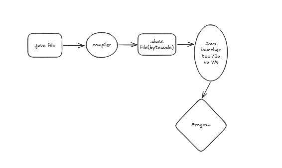
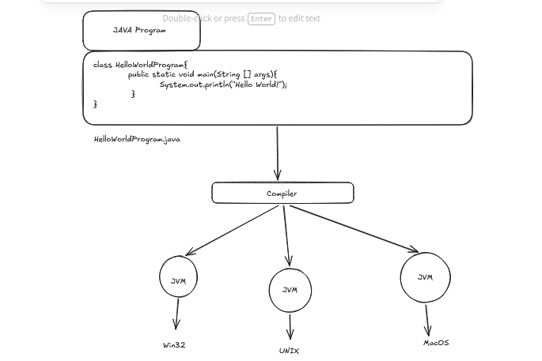
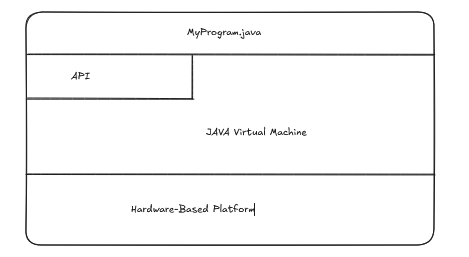

# Java 

- Java is both a programming language and a platform.

## The Java Programming Language

- In the Java programming language all code is written in plain text files ending with .java extension. Those source files are then compiled into .class files byt the java compiler. 

- A *.class* file doesn not contain the code that is native to our processor, it instead contains **bytecodes**- the machine language of the **Java Virtual Machine**. 

- The Java launcher tool then runs the application with an instance of the Java Virtual Machine.



- Because the Java VM is available on many different operating systems, the same *.class* files are capable of running on microsoft windows, solaris os, linux or mac os.

- Some virtual machines, such as the **Java SE HotSpot at a Glance**, perform additonal steps at a runtime to give our application a performance boost. This includes various tasks such as finding performance bottlenecks and recompiling (to native code) frequently used sections of code.

```java
class HelloWorldApp{
    public static void main(String [args]){
        System.out.println("Hello World!");
    }
}
```

- Through the Java VM , the same application is capable of running on multiple platforms.



## The Java Platform

- A platform is the hardware or a software environment in which a program runs.

- Most platforms can be described as the combination of the underlying hardware and the operating system.

- The java platform differs from others as it is a software only platform that runs on top of other hardware-based platforms.

- It has 2 components:
    - The Java virtual machine
    - The Java application programming Interface(API)

- The JVM is the base for the Java platform and is ported onto various hardware-based platforms.

- The API is a large collection of ready-made software components that provide many useful capabilities. It is grouped into libraries of related classes and interfaces; these libraries are known as *packages*. 



- The API and JVM insulates the program from the underlying hardware.

- As a Platform independent environment, the java platform can be a bit slower than the native code.

### What it can do?

- The general purpose, high level Java programming language is a powerful platform. Every full implementation of the platform gives us the following features:
    - **Development Tools**: The development tools provide everything we'll need for compiling, running, monitoring, debugging,and documenting your applications. 

    - **Application Programming Interface(API)**: The API provides the core functionality of the Java programming language. It offers a wide array of useful classes ready for use in your own applications. It spans evrything from basic objects, to networking and security, to XML generation and database access, and more. 
    - **Deployment Technologies**: The JDK software provides standard mechanisms such as the java web start sofware and java plug-in software for deploying your applications to end users.
    - **Users interface toolkits**:The JavaFX, Swing and Java 2D toolkits make it possible to create sophisticated Graphical User Interfaces.
    - **Integration Libraries**: Integration libraries such as the Java IDL API, JDBC API, Java Naming and Directory Interface(JNDI) API, Java RMI, and Java Remote Method Invocation over Internet Inter-ORB Protocol Technology enable database access and manipulation of remote objects.