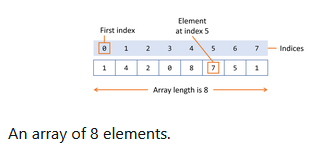

# Array

- An array is a container object that holds a fixed number of values of a single type.

- The length of the array is established when the array is created. After creation, it's length is fixed.



- Each item in the array is called an *element*, and each element is accessed by its numerical *index*. As shown in the preceding illustration, numbering begins with 0. 

- The following example creates an array of integers, puts some values in the array, and prints each value to standard output.

```java
    //declares an array of integers
    int[] Array;
    // allocates memory for 10 integers
    Array= new int[10];
    // initialize first element
    Array[0]=100;
    // initilaize second element
    Array[1]=200;
        for(int i=2;i<10;i++){
        anArray[i]=anArray[i-1]+100;
    }
    for(int i=0;i<10;i++){
    System.out.println("Element at index "+i+" : "+anArray[i]);
    }
```

### Declaring a Variable to refer to any array

- We can declare an array named Array with the following line of code:

```java
int[] Array;
```
- Like declarations for variables of other types, an array declaration has two components: the array's type and the array's name. An array's type is written as type[], where type is the data type of the contained elements; the brackets are the special symbols indicating that this variable holds an array. The size of the array is not part of its type. An array's name can be anything we want, provided that it follows the rules and conventions discussed earlier. As with variables of other types, the declaration doesnot actually create an array; it simply tells the compiler that this variable will hold an array of the specified type. We can also place the brackets after the array's name, though its not recommended.

## Creating, Initializing and Accessing an Array

- One way to create an array is with the new operator. The next statement allocates an array with enough memory for 10 integer elements and assigns the array to the anArray variable.

```java
anArray=new int[10];
```
- Shortcut syntax to create and initialize array.
```java
int[] anArray={
    100,200,3000,4000
};
```
### Creating multidimensional Arrays

- As an array can hold any reference, and since an array itself is a reference, we can easily create arrays of arrays.

- Arrays of arrays are also known as multidimensional array. We can declare them by using 2 or more sets of brackets, such as String[][] names. Each element, therefore must be accessed by a corresponding number of index values.

- In the Java programming language, a multidimensional array is an array whose components are themselves arrays. This is unlike C or Fortran, where a bidimensional array is a contiguous zone of memory, directly accessed using a pointer. In java an array is a contiguous zone of memory, but as a bidimenisonal array is an array of references, it is not itself a contiguous zone of memory.

- A consequence of this is that the rows are allowed to vary in length.

```java
String[][] names={
    {"Mr.","Mrs.","Ms."},
    {"Smith","Jones"}
};
```

### Using the length of an Array

- Finally, we can use the built-in length property defined on any array to determine the size of this array. 

```java
IO.println(anArray.length);
```

- This is specially useful for arrays of arrays, in which each array can be of different length. 

```java
   void displayBidimensionalArray(String[][] strings) {
    for (int arrayIndex = 0; arrayIndex < strings.length; arrayIndex++) {
        for (int index = 0; index < strings[arrayIndex].length; index++) {
            IO.print(strings[arrayIndex][index] + " ");
        }
        IO.println();
    }
}
String[][] strings = {
   {"one"},
   {"Maria", "Jennifer", "Patricia"},
   {"James", "Michael"},
   {"Washington", "London", "Paris", "Berlin", "Tokyo"}
};

displayBidimensionalArray(strings);

```

### Copying Arrays

- The System class has an **arraycopy()** method that we can use to efficiently copy data from one array into another:

```java
public static void arraycopy(Object src, int srcPos, Object dest, int destPos, int length)
```
- The 2 Object arguments specify the array to copy from and the array to copy to. The three int arguments specify the starting position in the source array, the starting position in the destination array, and the number of array elements to copy.

```java
String[] copyFrom={ "Affogato", "Americano", "Cappuccino", "Corretto", "Cortado",
   "Doppio", "Espresso", "Frappucino", "Freddo", "Lungo", "Macchiato",
   "Marocchino", "Ristretto"};
   String[] copyTo=new String[7];
   System.arraycopy(copyFrom,2,copyTo,0,7);
   for(String coffee:copyTo){
    IO.print(coffee+" ");
   }
```
### Array Manipulations

- Arrays are a powerful and useful concept used in programming. Java SE provides methods to perform some of the most common manipulations related to arrays. 

- Common tasks such as copying, sorting and searching arrays are implemented by methods from the Arrays class. For instance, the previous example can be modified to use the Arrays.copyOfRange() method of the Arrays class. The difference is that using the Arrays.copyOfRange() method doesnot require us to create the destination array before calling the method, because the destination array is returned by the method. Note that this method has several overloads to accomodate for the arrays of primitive types.

```java
String[] copyFrom = {
    "Affogato", "Americano", "Cappuccino", "Corretto", "Cortado",
    "Doppio", "Espresso", "Frappucino", "Freddo", "Lungo", "Macchiato",
    "Marocchino", "Ristretto" };

String[] copyTo = Arrays.copyOfRange(copyFrom, 2, 9);
for (String coffee : copyTo) {
    IO.print(coffee + " ");
}
```

- Some other useful operations provided by methods in the Arrays class are:

    - Searching an array for a specific value to get the index at which it is placed (the binarySearch() method).
    - Comparing two arrays to determine if they are equal or not (the equals() method).
    - Filling an array to place a specific value at each index (the fill() method).
    - Sorting an array into ascending order. This can be done either sequentially, using the sort() method, or concurrently, using the parallelSort() method introduced in Java SE 8. Parallel sorting of large arrays on multiprocessor systems is faster than sequential array sorting.
    - Creating a stream that uses an array as its source (the stream() method). For example, the following statement prints the contents of the coffees array in the same way as in the previous example:

```java
String[] coffees = {
    "Affogato", "Americano", "Cappuccino", "Corretto", "Cortado",
    "Doppio", "Espresso", "Frappucino", "Freddo", "Lungo", "Macchiato",
    "Marocchino", "Ristretto" };

Arrays.stream(coffees)
      .map(coffee -> coffee + " ")
      .forEach(IO::print);
```

- Converting an array to a string. The toString() method converts each element of the array to a string, separates them with commas, then surrounds them with brackets. 

```java
String[] coffees = {
    "Affogato", "Americano", "Cappuccino", "Corretto", "Cortado",
    "Doppio", "Espresso", "Frappucino", "Freddo", "Lungo", "Macchiato",
    "Marocchino", "Ristretto" };

var coffeesAsString = Arrays.toString(coffees)
IO.prinln(coffeesAsString);
```