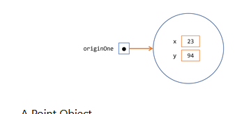
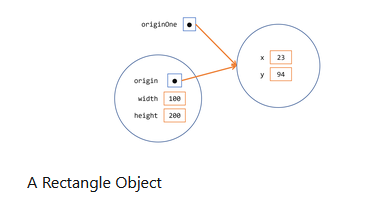

# Creating and Using Objects

### Understanding What Objects Are

- A typical Java program creates many objects, which as we know, interact by invoking methods. Through these object interactions, a program can carry out various tasks, such as implementing a GUI, running an animation, or sending and receiving information over a network. Once an object has completed the work for which it was created,its resources are recycled for use by other objects.

### Creating Objects

- As we know, a class provides the blueprint for objects; we create an object from a class. 

```java
Point origin=new Point(23,94);
Rectangle rectangle=new Rectangle(origin,100,200);
```
- Each of these statements has three parts:

    1. Declaration: Point origin and Rectangle rectangle are variable declarations that associate a variable name with an object type.

    2. Instantiation: The new keyword is a Java operator that creates the object.

    3. Initialization: The new operator is followed by a call to a constructor, which initializes the new object.

##### Declaring a Variable to Refer to an Object

- Previously, we learned that to declare a variable , we write:

```java
type name;
```

- This notifies the compiler that we will use name to refer to data whose type is type. With a primitive variable, this declaration also reserves the proper amount of memory for this variable.

- We can also declare a reference variable on its own line. For example:

```java
Point origin;
```

- If we declare origin like this, its value will be undetermined until an object is actually created and assigned to it. Simply declaring a reference variable does not create an object. For that we need to use the new operator. We must assign an object to origin before we use it in our code. Otherwise, we will get a compiler error.

- A variable in this state, currently references no object.

##### Instantiating a Class

- The new operator instantiates a class by allocating memory for a new object and returning a reference to that memory. The new operator also invokes the object constructor.

- The phrase "instantiating a class" means the same thing as "creating an object".

- The new operator requires a single, postfix argument: a call to a constructor. The name of the constructor provides the name of the class to instantiate.

- The new operator returns a reference to the object it created. This reference is usually assigned to a variable of the appropriate type, like:

```java
Point origin=new Point(23,94);
```

- The reference returned by the new operator doesnot have to be assigned to a variable. It can also be used directly in an expression.

```java
int x= new Point(23,94).x;
```

##### Initializing an Object

- This class Point from the previous example contains a single constructor. We can recognize a constructor because its declaration uses the same name as the class and it has no return type. The constructor in the Point class takes two integer arguments, as declared by the code(int x, int y). The following statement provides 23 and 94 as values for those arguments.

- The result of executing this statement can be illustrated in the next figure:



- We can create as many constructors as we need in a class. 

```java
class Point{
    int x,y;
    Point(int x,int y){
        this.x=x;
        this.y=y;
    }
}
class Rectangle{
    int width,height;
    Point origin;
    Rectangle(){
        origin=new Point(0,0);
    }
    Rectangle(Point p){
        this.origin=p;
    }
    Rectangle(int width,int height){
        this.origin=new Point(0,0);
        this.width=width;
        this.height=height;
    }
}
Point origin=new Point(10,10);
Rectangle rectangle=new Rectangle(origin,100,200);
IO.println("Rectangle:");
IO.println(" rectangle origin x ="+rectangle.origin.x);
IO.println("   rectangle origin y = " + rectangle.origin.x);
IO.println("   rectangle width  = " + rectangle.width);
IO.println("   rectangle height = " + rectangle.height);
```

- Each constructor lets us provide initial values for the rectangle's origin,width,height using both primitive and reference types.If a class has multiple constructors, they must have different signatures. The java compiler differentiates the constructors based on the number and the type of the arguments. When the Java compiler encounters the following code, it knows to call the Rectangle class that requires a Point argument followed by two integer arguments.

```java
Rectangle rectangle = new Rectangle(origin, 100, 200);
```

- This calls one of Rectangle's constructor that initializes origin to origin. Also, the constructor sets width to 100 and height to 200. Now there are 2 references to the same Point object - an object can have multiple references to it, as shown in the figure:



- The following line of code calls the Rectangle constructor that requires two integer arguments, which provide the initial values for width and height. If we inspect the code within the constructor, we will see that it creates a new Point object whose x and y are initialized to 0:

```java
Rectangle rectangle = new Rectangle(50, 100);
```

- The Rectangle constructor used in the following statement doesnot take any arguments,so it is called a no-argument constructor:

```java
Rectangle rectangle = new Rectangle();
```

- All classes have at least one constructor. If a class doesnot explicitly declare any, the Java compiler automatically provides a no-argument constructor, called the  default constructor. This default constructor calls the class parent's no-argument constructor, or the  Object constructor if the class has no other parent. If the parent has no constructor(Object does have one), the compiler will reject the program.

### Using Objects

- Once we have created an object, we probaly want to use it for something. We may need to use the value of one of its fields, change one of its fields, or call one of its methods to perform an action.

##### Referencing an Object's Fields

- Object fields are accessed by their name. We must use a name that is unambiguous.

- We may use a simple name for a field within its own class. Foe eg, we can add a statement within the Rectangle class that prints the width and height:

```java
IO.println("Width and height are: " + width + ", " + height);
```

- Code that is outside the object's class must use an object reference or expression, followed by the dot(.) operator, followed by a simple field name, as in:

```java
objectReference.fieldName
```

- For example, the following code is outside the code for Rectangle class. So to refer to the origin, width,height fields within the Rectangle object named rectangle, this code must use the names rectangle.origin, rectangle.height and rectangle.width. The program uses two of these names to print the width and the height of rectangle:

```java
IO.println("Width of rectangle: "  + rectangle.width);
IO.println("Height of rectangle: " + rectangle.height);
```

- Attempting to use the simple names width and height from the code outside of the Rectangle class doesnot make sense- those fields exist only within an object - and results in a compiler error.

- We can use similar code to display information about another instance of Rectangle. Objects of the same type have their own copy of the same instance fields. Thus, each Rectangle object has fields named origin, width, and height. When you access an instance field through an object reference, you reference that particular object's field. If you have two objects rectangle1 and rectangle2, they have different origin, width, and height fields.

- To access a field, we can use a named reference to an object, as in the previous examples, or we can use any expression that returns an object reference. Recall that the new operator returns a referencr to an object. So we could use the value returned from new to access a new object's fields:

```java
int height = new Rectangle().height;
```

- This statement creates a new Rectangle object and immediately gets its height. In essence, the statement calculates the default height of a Rectangle. Note that after this statement has been executed, the program no longer has a reference to the created Rectangle, because the program never stored the reference anywhere. The object is unreferenced, and its resources are free to be recycled by the Java Virtual Machine.

##### Calling an Object's Methods

- We also use an object reference to invoke an object's method. We append the method's simple name to the object reference, with an intervening dot operator(.). Also, we provide,within enclosing parantheses, any arguments to the method. If the method doesnot require any arguments, use empty parantheses.

```java
class Point{
    int x, y;
    Point(int x, int y){
        this.x=x;
        this.y=y;
    }
}
class Rectangle{
    int width,height;
    Point origin;
    Rectangle(Point origin,int width, int height){
        this.origin=origin;
        this.width=width;
        this.height=height;
    }
    Rectangle(int width,int height){
        this.origin=new Point(0,0);
        this.width=width;
        this.height=height;
    }
    int area(){
        return this.width*this.height;
    }
    void move(int dx,int dy){
        this.origin.x+=dx;
        this.origin.y+=y;
    }
    void print() {
      IO.println("Rectangle");
      IO.println("  origin x: " + origin.x);
      IO.println("  origin y: " + origin.y);
      IO.println("  width:    " + width);
      IO.println("  height:   " + height);
   }
}
Point origin = new Point(0, 0);
Rectangle rectangle = new Rectangle(origin, 20, 10);
rectangle.print();
IO.println("Area: " + rectangle.area());
IO.println("Moving rectangle");
rectangle.move(5, 15);
rectangle.print();
IO.println("Area: " + rectangle.area());
```

- As with instance fields, objectReference must be a reference to an object. We can use a variable name, but we also can use any expression that returns an object reference. The new operator returns an object reference, so we can use the value returned from new to invoke a new object's methods:

```java
new Rectangle(100,50).area();
```

### The Garbage Collector

- Some object-oriented languages require that we keep track of all the objects we create and that we explicitly destroy them when they are no longer needed. Managing memory explicitly is tedious and error-prone. The Java platform allows us to create as many objects as we want(limited, of course, by what our system can handle) and we donot have to worry about destroying them. The Java runtime environment deletes objects when it determines that they are no longer being used. This process is called garbage collection.

- An object is eligible for garbage collection when there are no more references to that object. References that are held in a variable are usually dropped when the variable goes out of scope. Or we can explicitly drop an object reference by setting the variable to the special value null. Remember that a program can have multiple references to the same object; all references to an object must be dropped before the object is eligible for garbage collection.

- The Java runtime environment has a garbage collector that periodically frees the memory used by objects that are no longer referenced. The garbage collector does its job automatically when it determines that the time is right.