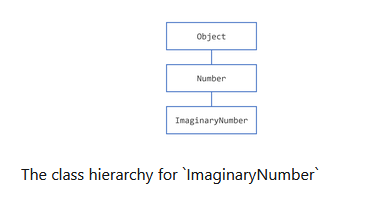
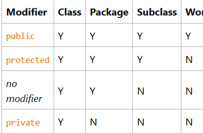

# More on Classes

### Returning a Value from a Method

- A method returns to the code that invoked it when it:
    - completes all the statements in the method,
    - reaches a return statement, or
    - throws an exception,
    - whichever occurs first.

- we declare a method's return type in its method declaration. Within the body of the method, we use a return statement to return the value.

- Any method declared void doesnot return a value. It doesnot need to contain a return statement,but it may do so. In such a case, a return statement can be used to branch out of a control flow block and exit the method and is simply used like this:

```java
return;
```

- If we try to return a value from a method that is declared void, we will get a compiler error.

- The data type of the return value must match the method's declared return type; you cannot return an integer value from a method declared to return a boolean.

- A method can also return a reference type.

### Returning a Class or Interface

- When a method uses a class name as its return type, the class of the type of the returned object must be either a subclass of, or the exact class of, the return type. 

- Suppose that you have a class hierarchy in which ImaginaryNumber is a subclass of java.lang.Number, which is in turn a subclass of Object, as illustrated in the following figure.



- Now suppose that we have a method declare to return a Number. This method can return an ImaginaryNumber but not an object. An instance of ImaginaryNumber is also an instance of Number because ImaginaryNumber is a subclass of Number. However an Object is not necessarily a Number ,it could be a String or another type.

- We can override a method and define it to return a subclass of the original method, like this:

```java
public ImaginaryNumber returnANumber(){
    ...
}
```
- This technique,called *covariant return* type, means that the return type is allowed to vary in the same direction as the subclass.

- We can also use use interface name as return types. In this case, the object returned must implement the specified interface.

### Using the this keyword

- Within an instance method or a constructor, this is a reference to the current object, the object whose method or constructor is being called. We can refer to any member of the current object from within an instance method or a constructor by using this.

##### Using this with a Field

- The most common reason for using the this keyword is because a field is shadowed by a method or constructor parameter. 

```java
public class Point {
    public int x = 0;
    public int y = 0;
        
    //constructor
    public Point(int x, int y) {
        this.x = x;
        this.y = y;
    }
}
```
- Each argument to the constructor shadows one of the object's fields — inside the constructor x is a local copy of the constructor's first argument. To refer to the Point field x, the constructor must use this.x.


##### Using this with a Constructor

- From within a constructor, you can also use the this keyword to call another constructor in the same class. Doing so is called an explicit constructor invocation. Here is another Rectangle class, with a different implementation from the one in the Objects section.

```java
public class Rectangle {
    private int x, y;
    private int width, height;
        
    public Rectangle() {
        this(0, 0, 1, 1);
    }
    public Rectangle(int width, int height) {
        this(0, 0, width, height);
    }
    public Rectangle(int x, int y, int width, int height) {
        this.x = x;
        this.y = y;
        this.width = width;
        this.height = height;
    }
    ...
}
```

- This class contains a set of constructors. Each constructor initializes some or all of the rectangle's member variables. The constructors provide a default value for any member variable whose initial value is not provided by an argument. For example, the no-argument constructor creates a 1x1 Rectangle at coordinates 0,0. The two-argument constructor calls the four-argument constructor, passing in the width and height but always using the 0,0 coordinates. As before, the compiler determines which constructor to call, based on the number and the type of arguments.

### Controlling Access to Members of a Class

- Access level modifiers determine whether other classes can use a particular field or invoke a particular method. There are 2 levels of access control:

    - At the top level - public, or package-private.
    - At the member level- public, private, protected or package-private

- A class may be declared with the modifier public, in which case that class is visible to all classes everywhere. If a class has no modifier(the default, also known as package-private), it is visible only within its own package(packages are named groups of related classes).

- At the member level, we can also use the public modifier or no modifier just as with top-level classes and with the same meaning. For members, there are 2 additional access modifiers: private and protected. The private modifier specifies that the member can only be accessed in its own class. The protected modifier specifies that the member can only be accessed within its own package and, in addition, by a subclass of its class in another package.



- The first data column indicates whether the class itself has access to the member defined by the access level. As we can see, a class always has access to its own members.

- The second column indicates whether classes in the same package as the class (regardless of their parentage) have access to the member.

- The third column indicates whether subclasses of the class declared outside this package have access to the member.

- The fourth column indicates whether all classes have access to the member.

- Access levels affect you in two ways. First, when you use classes that come from another source, such as the classes in the Java platform, access levels determine which members of those classes your own classes can use. Second, when you write a class, you need to decide what access level every member variable and every method in your class should have.

##### Tips on Choosing an Access Level

- If other programmers use our class, we want to ensure that errors from misuse cannot happen. Access levels can help us do this.

- Use the most restrictive access level that makes sense for a particular member. Use private unless we have a good reason not to.

### Understanding Class Members

##### Class Variables

- When a number of objects are created from the same class blueprint, they each have their own distinct copies of instance variables. 

- Sometimes we want to have variables that are common to all objects. This is accomplished with the static modifier. Fields that have the static modifier in their declaration are called static fields or class variables. They are associated with the class, rather than with any object.

- Every instance of the class shares a class variable, which is in one fixed location in memory. Any object can change the value of a class variable, but class variables can also be manipulated without creating an instance of the class.

##### Class Methods

- The java programming language supports static methods as well as static variables. Static methods, which have the static modifier in their declarations, should be invoked with the class name, withoout the need for creating an instance of the class.

- A common use for static methods is to access static fields. 

- Not all combinations of instance and class variables and methods are allowed:
    - Instance methods can access instance variables and methods directly.
    - Instance methods can access class variables and methods directly.
    - Class methods can access class variables and class methods directly.
    - Class methods cannot access instance variables and methods directly- they must use an object reference. Also, class methods cannot use the this keyword as there is not instance for this to refer to.

##### Constants

- The static modifier, in combination with the final modifier, is also used to define constants. The final modifier indicates that the value of this field cannot change.

- Constants defined in this way cannot be reassigned, and it is a compile-time error if our program ties to do so. By convention, the names of constant values are spelled in uppercase letters. If the names is composed of more than one word, the words are separated by an underscore.

- If a primitive type or a string is defined as a constant and the value is known at compile time, the compiler replaces the constant name everywhere in the code with its value. This is called a compile-time constant. If the value of the constant in the outside world changes, we will need to recompile any classes that use this constant to get the current value.


##### The Bicycle Class

```java
public class Bicycle {
        
    private int cadence;
    private int gear;
    private int speed;
        
    private int id;
    
    private static int numberOfBicycles = 0;

        
    public Bicycle(int startCadence,
                   int startSpeed,
                   int startGear) {
        gear = startGear;
        cadence = startCadence;
        speed = startSpeed;

        id = ++numberOfBicycles;
    }

    public int getID() {
        return id;
    }

    public static int getNumberOfBicycles() {
        return numberOfBicycles;
    }

    public int getCadence() {
        return cadence;
    }
        
    public void setCadence(int newValue) {
        cadence = newValue;
    }
        
    public int getGear(){
        return gear;
    }
        
    public void setGear(int newValue) {
        gear = newValue;
    }
        
    public int getSpeed() {
        return speed;
    }
        
    public void applyBrake(int decrement) {
        speed -= decrement;
    }
        
    public void speedUp(int increment) {
        speed += increment;
    }
}
```

### Initializing Fields

- As we have seen, we can often provide an initial value for a field in its declaration:

```java
public class BedAndBreakfast {

    // initialize to 10
    public static int capacity = 10;

    // initialize to false
    private boolean full = false;
}
```

- This works well when the initialization value is available and the initialization can be put on one line. However, this form of initialization has limitations because of its simplicity. If initialization requires some logic (for example, error handling or a for loop to fill a complex array), simple assignment is inadequate. Instance variables can be initialized in constructors, where error handling or other logic can be used. To provide the same capability for class variables, the Java programming language includes static initialization blocks.

- It is not necessary to declare fields at the beginning of the class definition, although this is the most common practice. It is only necessary that they be declared and initialized before they are used.

##### Static Initialization Blocks

- A static initialization block is a normal block of code enclosed in braces and preceded by the static keyword.

```java
static{
    //whatever code is needed for initialization goes here
}
```

- A class can have any number of static initialization blocks and they can appear anywhere in the class body. The runtime system guarantees that static initialization  blocks are called in the order that they appear in the source code.

- We can write private static methods instead. The advantage of private static methods is that they can be reused later if we need to reinitialize the class variable.

- We should be aware that we cannot redefine the content of a static block.Once it has been written, you cannot prevent this block to be executed. If the content of the static block cannot be executed for whatever reason, then your application will not work properly, because you will not be able to instantiate any object for this class. This may happen if your static block contains code that accesses some external resource, like a file system, or a network. 

##### Initializing Instance Members

- Normally we would put code to initialize an instance variable in a constructor. There are 2 alternatives to using a constructor to initialize instance variables: initializer blocks and final methods.

- Initializer blocks for instance variables look just like static initializer blocks, but without the static keyword:

```java
{
//whatever is needed here for initialization
}
```

- The Java compiler copies initializer blocks into every constructor. Therefore, this approach can be used to share a block of code between multiple constructors.

- A final method cannot be overridden in a subclass. 

```java
class Whatever {
    private varType myVar = initializeInstanceVariable();
        
    protected final varType initializeInstanceVariable() {

        // initialization code goes here
    }
}
```

- This is especially useful if subclasses might want to reuse the initialization method. The method is final because calling non-final methods during instance initialization can cause problems.