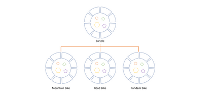

# Object, Class, Inheritance, Interface, Package

#### Objects

- An object is a software bundle of related state and behavior. 

- Objects have 2 characterstics: they all have state and behavior. Dogs have state(name,color,breed, hungry) and behavior(barking,fetching,wagging tail). Bicycles also have state(current gear, current pedal cadence, current speed) and behavior(changing gear, changing pedal cadence, applying breaks). 

- So we can say that the Fields are state and Methods are behavior. **Data:State; Action on data:Behavior**

- Software objects consists of state and related behavior. An object stores its states in fields(varibles in some programming languages) and exposes its behaviour through *methods*(functions). Methods operate on an object's internal state and serve as the primary mechanism for object-to-object communication. Hiding internal state and requiring all interaction to be performed through an object's methods is known as **data encapsulation** - a fundamental principle of object-oriented programming.
```java
class Bicycle{
    int cadence=0;
    int speed=0;
    int gear=1;
    void changeCadence(int newValue){
        cadence=newValue;
    }
    void changeGear(int newValue){
        gear=newValue;
    }
    void speedUp(int increment){
        speed=speed+increment;
    }
    void speedDown(int decrement){
        speed=speed-decrement;
    }
    void printState(){
        System.out.println('cadence: ' + cadence+' gear: '+gear+' speed: '+speed);
    }
}
```
- By attributing state(current speed, current pedal cadence, and current gear) and providing methods for changing that state, the object remains in control of how the outside world is allowed to use it. For example, if the bicycle only has 6 gears, a method to change gears could reject any value that is less than 1 or greater than 6.

- Bundling code into individual software objects provides a number of benefits including:

1. Modularity: The source code for an object can be written and maintained independently of the source code for other objects. Once created, an object can be easily passed around inside the system.

2. Information-hiding: By interacting only with an object's methods, the details of its internal implementation remain hidden from the outside world.

3. Code re-use: If an object already exists, you can use that object in the program. This allows specialists to implement/test/debug complex, task-specific objects, which you can then trust to run in your own code.

4. Pluggability and debugging ease: If a particular object turns out to be problematic, we can simply remove it from our application and plug in a different object as its replacement.

#### What is a class?

- In our applications, we will often find many individual objects all of the same kind. There may be thousands of other bicycles in existence, all of the same make and model. Each bicycle was built from the same set of blueprints and therefore contains the same components. In object-oriented terms, we say that our bicycle is an instance of the class of objects known as bicycles. A class is the blueprint from which individual objects are created.
```java
class BicycleDemo{
    public static void main(String[] args main){
        Bicycle bike1=new Bicycle();
        Bicycle bike2=new Bicycle();
        bike1.changeCadence(50);
        bike1.speedUp(10);
        bike1.changeGear(2);
        bike1.printState();

        bike2.changeCadence(40);
        bike2.speedup(10);
        bike2.changeGear(2);
        bike2.changeCadence(30);
        bike2.speedup(20);
        bike2.changeGear(3);
        bike2.printState();
    }
}
```
### What is Inheritance

- Different kinds of objects often have a certain amount in common with each other. Mountain bikes, road bikes,and tandem bikes, for example, all share the characterstics of bicycles. Yet each also defines additional features that make them different: tandem bicycles have 2 seats and 2 sets of handlebars; road bikes have drop handlesbars; some mountain bikes have an additional chain ring, giving them a lower gear ratio.

- Object-oriented programming allows classes to inherit commonly used state and behavior from other classes. In this example, Bicycle is the superclass of MountainBike, RoadBike and TandemBike. 

- In Java, each class is allowed to have one **direct superclass**, and each superclass has the potential for an unlimited number of subclasses:


The syntax for creating a subclass is simple. At the beginning of the class declaration, use the extended keyword, followed by the name of the class to inherit from:
```java
class MountainBike extends Bicycle{
    int handlePos=0;
    void changeHandlePos(int newPos){
        handlePos=newPos;
    }
    void printStates(){
        System.out.println("Cadence: "+cadence+" Gear: "+ gear+" speed: "+speed+" Handle Position: "+handlePos);
    }
}
```
- This gives MountainBike all the same fields and methods as Bicycle, yet allows its code to focus exclusively on the features that make it unique. This makes code for the subclasses easy to read.

### What is an Interface?

- Objects define their interaction with the outside world through the methods that they expose. Methods form the object's interface with the outside world; the buttons on the front of the television for example, are the interface between us and the electrical wiring on the other side of its plastic casing. We press the "power" button to turn the television on and off.

- In its most common form, an interface is a group of related methods with empty bodies. A bicycle's behavior, if specified as an interface, might appear as follows:

```java
interface Bicycle{
    void changecadence(int newValue);
    void changeGear(int newValue);
    void speedUp(int increment);
    void applyBreaks(int decrement);
}
```
- To implement this interface, the name of our class would change(to a particular brand of bicycle) and we would use the implements keyword in the class.

```java
class ACMEBicycle implements Bicycle{
    int cadence=0;
    int speed=0;
    int gear=1;
    public void changeCadence(int newValue){
        cadence=newValue;
    }
    public void changeGear(int newValue){
        gear=newValue;
    }
    public void speedUp(int increment){
        speed=speed+increment;
    }
    public void applyBreaks(int decrement){
        speed=speed-decrement;
    }
    void printStates(){
        System.out.println("cadence:"+cadence+" speed:"+speed+" gear:"+ gear);
    }
}
```

- Implementing an interface allows a class to become more formal about the behavior it promises to provide. Interfaces form a contract between the class and the outside world, and this contract is enforced at build time by the compiler. If our class claims to implement an interface, all methods defined by that interface must appear in its source code before the class will successfully compile.

### What is a Package?

- A package is a namespace that organizes a set of related classes and interfaces.

- It's like different folders on our computers, one folder for all html files, one for images and so on. 

- It makes sense to keep things organized by placing related classes and interfaces into packages.

- The java platform provides an enormous class library (a set of packages) suitable for use in our own applications. This library is known as the "Application Programming Interface". It's packages represent the tasks most commonly associated with general-purpose programming. For example, a String object contains state and behavior for character strings; a File object allows us to easily create, delete, inspect, compare or modify a file on the filesystem; a socket object allows for the creation and use of network sockets; various GUI objects control buttons and check boxes and anything else related to graphical user interfaces.
