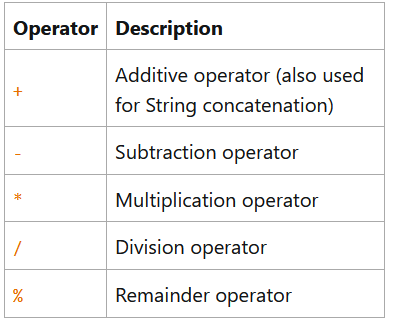
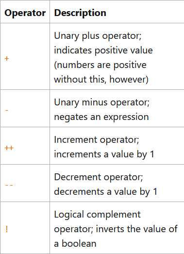
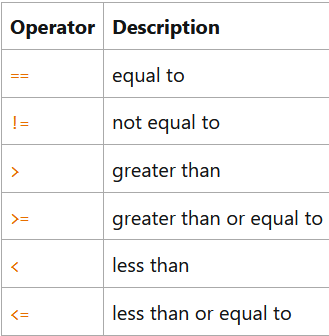
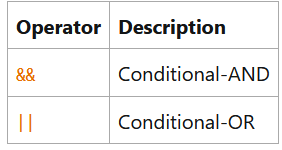

# Operators 

- Operators are special symbols that perform specific operations on one, two,or three operands and then return a result.

- Operators with high precedence are evaluated before operators with relatively lower precedence. 

- All binary operators except the assignment operators are evaluated from left to right; assignment operators are evaluated right to left.

|Operators|Precedence|
|:--------|:---------|
|postfix|expr++ expr--|
|unary|++exp --exp +expr -expr ~!|
|multiplicative|* / %|
|additive|+ -|
|shift |<< >> >>>|
|relational|< > <= >= instanceof|
|equality|== !=|
|bitwise AND|&|
|bitwise exclusive OR|^|
|bitwise inclusive OR|\||
|logical AND|&&|
|logical OR|\|\||
|ternary|? :|
|assignment|= += -= *= /= %= &= ^= \| = <<= >>= >>>=|

### Simple assignment operator

- **=** is the assignment operator.

```java
int cadence=0;
int speed=0;
```
- This operator can also be used on objects to assign object references.

### The Arithmetic Operators

- There are operators to perform addition, subtraction,  multiplication, and division.



### The Unary Operators

- The unary operators require only one operand; they perform various operations such as incrementing/decrementing a value by one, negating an expression, or inverting the value of a boolean.



- The increment/decrement operators can be applied before(prefix) or after (postfix) the operand. The code result++; and ++result; will both end in result being incremented by one. The only difference is that the prefix version(++result) evaluates to the incremented value, whereas the postfix version(result++) evaluates to the original value. 

### The Equality and Relatioanl Operators

- The equality and relatioanl operators determine if one operand is greater than, less than, equal to or not equal to another operand.




### The Conditional Operators

- The && and || operators perform Conditional-AND and Conditional-OR operations on two boolean expressions. These exhibit "short-circuiting" behaviour, which means that the second operand is evaluated only if needed.



- Other conditional operator is ?: which can be thought of as shorthand for an if-then-else statement. This operator is also known as the ternary operator because it uses 3 operands. 

### The Type Comparison Operator Instanceof

- The instanceof operator compares an object to a specified type. We can use it to test if an object is an instance of a class, an instance of a subclass, or an instance of a class that implements a particular interface.

- When using the instanceof operator, keep in mind that null is not an instance of anything.

### Bitwise and Bit Shift Operators

- These perform bitwise and bit shift operations on integral types.

- The unary bitwise complement operator ~ inverts a bit pattern; it can be applied to any of the integral types, making every "0" a "1" and every "1" a "0". For example, a byte contains 8 bits; applying this operator to a value whose bit pattern is 00000000 would change its pattern to 11111111.

- The signed left shift operator << shifts a bit pattern to the left,and the signed right shift operator >> shifts a bit pattern to the right. The bit pattern is given by the left-hand operand, and the number of positions to shif by the right-hand operand. 

- The unsigned right shift operator >>> shifts a zero into the leftmost position, while the leftmost position after >> depends on sign extension.

- The bitwise & operator performs a bitwise AND operation.

- The bitwise ^ operator performs a bitwise OR operation.

- - The bitwise | operator performs a bitwise inclusive OR operation.