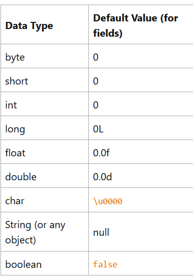

# Variables

- The Java programming language defines the following kinds of variables:

- **Instance Variable(Non-Static Fields)**: Objects store their individual states in "non-static fields", that is, fields declared without the static keyword. Non-static fields are also known as instance variables because their values are unique to each instance of a class(to each object, in other words); the currentSpeed of one bicycle is independent from the other.

- **Class Variables(Static Fields)**: A Class variable is any field declared with the static modifier; this tells the compiler that there is exactly one copy of this variable in existence, regardless of how many times the class has been instantiated. A field defining the number of gears for a particular kind of bicycle could be marked as static since conceptually the same number of gears will apply to all instances. The code ```static int numGears=6;``` would create such a static field. Additionally, the keyword **final** could be added to indicate that the number of gears will never change.

- **Local Variables**: Similar to how an object stores its state in fields, a method will often store its temporary state in local variables. The syntax for declaring a local variable is simialr to declaring a field(for example, int count=0;). There is no special keyword designating a variable as local; that determination comes entirely from the location in which the variable is declared -- which is between the opening and closing braces of a method. As such, local variables are only visible to the methods in which they are declared; they are not accessible from the rest of the class.

- **Parameters**: In ```public static void main(String[] args)``` , **args** variable is the parameter to this method. The important thing to remember is that parameters are always classified as "variables" and not "fields". This applies to other parameter-accepting constructs as well(such as constructors and exception handlers).

- A type's fields, methods, and nested types are collectively called it's **members**.

### Naming Variables

- Variables names are case-sensitive. A variable's name can be any legal identifier -- an unlimited length sequence of Unicode letters and digits, beginning with a letter the dollar sign $ or the underscore character. The convention however is to always use a letter in the beginning. By convention the dollar sign is never used nor the underscore.

- Subsequent characters may be letters, dollar signs, or underscore characters. When choosing a name for our variables, we should use full words instead of cryptic abbreviations. Doing this makes code easy to read and understand. Keep in mind that the variable name is not a keyword or a reserved word.

- If the name chosen consists of one word, spell that word in all lowercase letters. If it consists of more than one word, capitalize the first letter of each subsequent word. 

### Creating primitive Type Variables in Java

- Objects store their state in fields. However in Java, we use the term variables too. 

## Primitive Types

- The Java programming language is statically typed, which means that all variables must be declared before they can be used. This involves stating the variable's type and name like:

```java
int gear=1;
```

- Doing so tells the program that a field named gear exists, holds numeric data and has an intial value of 1. A variable's data type determines the values it may contain,plus the operations that may be performed on it. In addition to int, the Java programmming language supports seven other primitive data types. A primitive datatype is predefined by the language and is named by a reserved keyword. Primitive values do not share state with other primitive values. The eight primitive data types supported by the Java programming language are:

    - byte: The byte data type is an 8-bit signed two's complement integer. It has a minimum value of -128 and a maximum value of 127 (inclusive). The byte data type can be useful for saving memory in large arrays, where the memory savings actually matters. They can also be used in place of int where their limits help to clarify the code; the fact that a variable's range is limited can serve as a form of documentation.

    - short: The short data type is a 16-bit signed two's complement integer. It has a minimum value of -32,768 and a maximum value of 32767. As with byte the same guidelines apply: we can use a short to save memory in large arrays, in situations where the memory savings actually matter.

    - int: By default, the int data type is a 32-bit signed two's complement integer, which has a minimum value of $-2^{31}$ and a maximum value of $2^{31}-1$.

    - long: The long data type is a 64-bit signed two's complement integer, which has a minimum value of $-2^{63}$ and maximum value of $2^{63}-1$.

    - float: The float data type is a single precision 32-bit IEEE 754  floating point. Use float instead of double if you need to save memory in large arrays of floating point numbers. These should not be used for precise values. For that use java.math.BigDecimal class instead.

    - double: The double data type is a double precision 64 bit IEEE 754 floating point. For decimal values, this data type is generally the default choice. 

    - boolean: The boolean data type has only two possible values: true and false. use this data type for simple flags that track true/false conditions. This data type represents one bit of information.

    - char: The char data type is a single 16-bit Unicode character. It has a minimun value of \u0000(0) and a maximum value of \uffff(65,535 inclusive).

- Java SE 8 and later allows us to use the int data type to represent an unsigned 32-bit integer, which has a minimum value of 0 and a maximum value of $2^{32}-1$. Use the Integer class to use int data type as an unsigned integer. 

- Addition to the eight primitivee data types, Java provides support for character strings via the Java.lang.String class. 

```java
String s = "this is a string";
```
- String objects are immutable, which means that once created their values cannot be changed. 

### Initializing a Variable with a Default Value

- It is not always necessary to assign a value when a field is declared. Fields that are declared but not initialized will be set to a reasonable default by the compiler. This default will be 0 or null, depending on the data type. 



- Local variables are slightly different; the compiler never assigns a default value to an uninitialized local variable. If we cannot initialize our local variable where it is declared, we need to make sure to assign it a value before we use it. Accessing an uninitialized local variable will result in a compile-time error.

### Creating Values with Literals

- **New** keyword is not used when initializing a varibale of a primitive type. Primitive types are special data types built into the language; they are not objects created from a class. A literal is the source code representation of a fixed value; literals are represented directly in your code without requiring computation.

```java
boolean result=true;
char capitalC='C';
byte b= 100;
short s=10000;
int i =100000;
```

### Integer Literals

- An integer literal is of type long if it ends with the letter L or l; otherwise it is of type int. It is recommended to use the upper case letter L because the lower case letter l is hard to distinguish from the digit 1.

- Values of the integral types byte, short, int and long can be created from int literals. Values of type long that exceed the range of int can be created from long literals. Integer literals can be expressed by these number systems:

    - Decimal: Base 10, whose digits consists of the numbers 0 through 9
    - Hexadecimal: Base 16, whose digits consists of the numbers 0 through 9 and the letters A through F
    - Binary: Base 2, whose digits consists of the numbers 0 and 1.

```java
int decimalValue=26;
int hexadecimal=01xa;
int binaryValue=0b11010;
```

### Floating Point Literals

- A floating point literal is of type float if it ends with the letter F or f;; otherwise its type is double and it can optionally end with the letter D or d.

- The floating point types can also be expressed using E or e(for scientific notation), F or f(32-bit float literal) and D or d(64- bit double literal)

```java
double d1=123.4;
double d2= 1.234e2;
float f1=123.4f;
```

### Character and String Literals

- Literals  of types char and String may contain Unicode(UTF-16) characters. If our editor and file system allow it, we can use such characters directly in our code. If not, we will have to use a Unicode escape such as \u0108.

- Always use single quotes for char literals and double quotes for String literals. 

- The java programming language also supports a few special escape sequences for char and String literals such as: \b(backspace); \t(tab);\n(line feed);\f(from feed),\r(carriage return);\"(double quote);\'(single quote);\\(backslash).

- There is also a special null literal that can be used as a value for any reference type. The null literal may be assigned to any variable, except variables of primitive types. There is little we can do with a null value beyond testing for its presence. 

- Finally, there is also a special kind of literal called a **class literal** formed by taking a type name and appending a .class; for example, String.class. This refers to the object that represents the type itself, of type class.

### Using Underscore Characters in Numeric Literals

- Any number of underscores can appear anywhere between digits in a numerical literal. This feature enables us to separate groups of digits in numeric literals.

```java
long creditCardNumber = 1234_5678_9012_3456L;
long socialSecurityNumber = 999_99_9999L;
float pi =  3.14_15F;
long hexBytes = 0xFF_EC_DE_5E;
long hexWords = 0xCAFE_BABE;
long maxLong = 0x7fff_ffff_ffff_ffffL;
byte nybbles = 0b0010_0101;
long bytes =
0b11010010_01101001_10010100_10010010;
```
- We can place underscores only between digits, we can not place them in the following places:
    - At the beginning or end of a number
    - Adjacent to a decimal point in a floating point literal
    - Prior to an F or L suffix
    - In positions where a string of digits is expected.